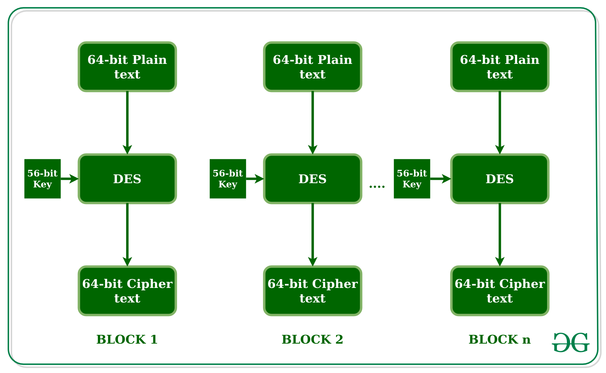

### Trying to find interesting patterns by cryptanalysis on the DES encryption algorithm.

Algorithms used:
* <a href="https://en.wikipedia.org/wiki/Floyd%E2%80%93Warshall_algorithm"> Floyd Warshall algorithm</a>
* <a href="https://en.wikipedia.org/wiki/Cycle_detection#Floyd's_tortoise_and_hare">Floyd's tortoise and hare</a>



```python
def floyd(
    distance_fn: Callable, 
    f: Callable, 
    x0: object, 
    delta: int,
    max_iter: int=math.inf,
    verbose: int=True,
):
    m = 1
    histogram = []
    tortue = f(x0)
    lievre = f(f(x0))
    if None in [tortue, lievre]:
        return [len(x0)]
    dist = distance_fn(pad_and_encrypt(tortue), pad_and_encrypt(lievre))

    while (dist > delta or lievre == tortue) and m <= max_iter:
        m = m + 1

        tortue = f(tortue)
        lievre = f(f(lievre))
        if tortue is None or lievre is None:
            break
        if lievre == tortue:
            continue

        dist = distance_fn(pad_and_encrypt(tortue), pad_and_encrypt(lievre))
        histogram.append(dist)

    if verbose:
        if m <= max_iter and not (tortue is None or lievre is None):
            print(f'\n[+] Found - number of differences: {dist}')
            dump_encrypt_values(lievre)
            dump_encrypt_values(tortue)
            print(f'iteration: {m}')
        else:
            print(f'No solution found in reasonable time. ({max_iter} iter)')
    return histogram
```
